# iot_database_2025

## 17일차 : 2월 25일

- MySQL 설치(docker을 통해)
    1. docker 실행 및 로그인 , power shell 오픈, 도커 확인
        ```shell
        >docker -v
        Docker version 27.5.1, build 9f9e405
        ```
    2. MySQL Docker 이미지 다운로드
        ```shell
        >docker pull mysql
        ```
        - `docker desktop - unexpected wsl error 일 경우, window 기능켜기/끄기에서 Hyper-V , Linux용 윈도우 하위 시스템,  가상머신 플랫폼 다 체크하고 다시시작하기`
    3. MySQL  이미지 확인
     ```shell
        >docker images
    ```
    4. docker 컨테이너 생성
    - MySQL Port 3306
    - Oracle Port 1521
    - SQL Server 1433
     ```shell
        >docker run --name mysql-container -e MYSQL_ROOT_PASSWORD=12345 -d -p 3306:3306 mysql:latest 
    ```
    5. 컨테이너 확인
       ```shell
        >docker ps -a 
        ```
    6. docker 컨테이너 시작, 중지, 재시작
       ```shell
        >docker stop mysql-container # 중지
        >docker start mysql-container # 시작
        >docker restart mysql-container # 재시작
        ```
    7. MySQL docker 컨테이너 접속
     ```shell
        >docker exec -it mysql-container bash
        bash-5.1# mysql -u root -p
        12345비번 입력
        mysql >show databases;
        mysql >exit  
        bash-5.1# exit 
        ```
- workbench 설치
    - https://dev.mysql.com/downloads/workbench/ -> goto download ->8.0.41 , Microsoft Windows / Windows (x-86, 32-bit) , MSI installer
    - MySQL Installer에서 workbench(applications 목록에서 찾기)와 samples and examples (documentation 목록에서 찾기) 설치
    - execute 계속 누르기, password 다 생략(취소)하고 설치 
    
- 데이터베이스 시스템
    - 통합된 데이터를 저장해서 운영하면서, 동시에 여러사람이 사용할 수 있도록 하는 시스템
    - 실시간 접근, 계속 변경, 동시 공유가 가능, 내용으로 참조(물리적으로 떨어져 있어도 사용가능)
    
    - DBMS 
        - MySQL, Oracle, SQL Server, MariaDB, MongoDB...
    
- 데이터 베이스 언어
    - SQL(Structured Query Language) : 구조화된 질의 언어(프로그래밍언어와 동일)
        - DDL : Create, Drop, Alter
        - DML : Select, Delete , Update, Insert
        - DCL : Commit, Rollback, Grant, Revoke

- 관계 데이터 모델
    - 3단계 DB 구조 : 외부스키마(실세계와 매핑) -> 개념스키마(DB논리적 설계-데이터와 관계, 제약사항, 무결성 등) -> 내부스키마(물리적 설계- 인덱스, 데이터 레코드의 배치방법, 데이터 압축 등)  -> DB
    
    - 모델에 쓰이는 용어
        - 릴레이션 -테이블과 매핑
        - 속성
        - 튜플
        - 관계

    - 무결성 제약조건
        - 키 - 기본키, 외래키, 슈퍼키, 대체키, 대리키
        - 개체 무결성, 참조 무결성, 도메인 무결성

- SQL 기초
    - SQL 개요
    ```sql
    select publisher, price
    from Book
    where bookname = '축구의 역사';
    ```


## 18일차 : 2월 26일
- SQL 개요
    - 데이터베이스에 있는 데이터 추출 및 처리작업을 위해서 사용되는 프로그래밍언어
    - 일반프로그래밍언어와 차이점
        - DB에서만 문제해결 가능
        - 입출력을 모두 DB에서 테이블로 처리
        - 컴파일 및 실행은 DBMS가 수행

- SQL 기초  [SQL](./day18/da01_select.sql)
    - 주석(-- ), 실행(ctrl + enter) 
    - `SELECT *  ALL의 의미.모든 열`
    - SQL문은 세미클론(;)과 함께 끝난다. 그러나 생략해도 된다.(C, Python 같은 코드로 가져갈 때는 반드시 삭제!)
    - 대소문자의 구분은 없지만 SQL 예약어는 대문자로, 테이블이나 속성 이름은 소문자로 적어줌
    - `MySQL에서 문자열은 홑따옴표' 사용`
    - `SELECT * FROM 테이블명 한 후, 열이름을 자동완성으로 작성하여 오타 줄인다.`

    - 데이터 조작어 - 검색(SELECT) , 삽입(INSERT) , 삭제(DELETE) , 수정(UPDATE)
    - 데이터 정의어 - CREATE, ALTER, DROP
    - 데이터 제어어 - GRANT, REVOKE

- SQL 기초 >데이터 조작어- 검색(SELECT)
    ```sql
    --SELECT 기본문법
    SELECT [ALL|DISTINCT] 컬럼명(들)
      FROM 테이블명(들)
     [WHERE 검색조건(들)]
     [GROUP BY 속성이름(들)]
     [HAVING 집계함수검색조건(들)]
     [ORDER BY 속성이름(들) [ASC|DESC]]
     [WITH ROLLUP] 
    ```
    - WHERE [SQL](./day18/da02_where.sql)
        - 비교 : = , <> , !=
            - price BETWEEN 10 AND 20 ;
        - 범위 : BETWEEN
            - price BETWEEN 10 AND 20 ;
        - 집합 : IN , NOT IN
        - 패턴 : LIKE
            - % : 0개이상의 문자열과 일치
            - _ : 1개의 문자와 일치


            - [] : 1개의 문자와 일치
            - [^] : 1개의 문자와 불일치
            - LIKE 연산자에서 [0-1]%와 같은 패턴을 사용하는 것은 MySQL에서 지원되지 않습니다. 
                ```sql
                SELECT *
                  FROM Book
                 WHERE bookname  REGEXP  '[0-1]%'
                ```
        - NULL : IS NULL, IS NOT NULL
        - 복합조건 : AND, OR, NOT 

 
    - ORDER BY [SQL](./day18/da03_order_by.sql)
        - ASC (기본값)
        - DESC
        - 오름차순 : 숫자, 알파벳 대문자, 알파벳 소문자, 한글(ㄱ-ㅎ)    

    - 집계함수  [SQL](./day18/da04_group_by.sql)
        - AS : 별칭 ,` 공백이 포함될 경우 작은따옴표로 묶기 (예) ' 평균 주문금액' (O) 평균 주문금액(X)`
        - SUM(속성이름) AS 합계
        - COUNT (속성이름| *)
            - ` NULL 값을 제외한 해당 속성의 투플 개수`
            - `COUNT(*) 전체 튜플의 수`
        - AVG(속성이름)
        - MAX
        - MIN
        - STD

    - GROUP BY [SQL](./day18/da04_group_by.sql)
        - 반드시 집계함수를 SELECT 안에 포함시켜야 함
        - `GROUP BY custid 일때, SELECT 에는 custid, 그외 나머지컬럼은 집계함수로 표현`
        - WHERE절, GROUP BY, HAVING절 순서이다.
        - `WITH ROLLUP `
           
            ```sql
            -- 고객별 주문수량, 총판매액 출력하고 , 전체를 합산하여 통계를 표시하세요
            SELECT custid
                  , count(*) AS 주문수량
                  , SUM(saleprice) AS 총판매액
              FROM Orders
             GROUP BY custid
             WITH ROLLUP;
            ```
    - 별칭을 이용하는 경우,
        ```sql
            SELECT custid
                , count(*) AS 주문수량
                , SUM(saleprice) AS 총판매액
            FROM Orders
            GROUP BY custid
            ORDER BY 총판매액 DESC;
        ```
    - 조인 
        - WHERE 부모테이블.기본키 = 자식테이블.외래키
        - INNER JOIN
            ```sql
                 SELECT c.custid
                    , c.name
                    , c.address
                    , o.orderid
                    , o.saleprice
                    , o.orderdate
                    , b.bookname
                    , b.publisher
                    , b.price
                FROM Customer AS c , Orders AS o , Book AS b
                WHERE c.custid = o.custid 
                    AND b.bookid = o.bookid;
            ```
        - OUTER JOIN
            - LEFT OUTER JOIN 또는 RIGHT OUTER JOIN - LEFT, RIGHT는 기준이 되는 테이블의 위치이며, 주로 부모테이블이 기준이 된다.
            ```sql
            SELECT c.name, o.saleprice
              FROM Customer AS c
              LEFT JOIN Orders AS o 
                ON c.custid = o.custid
            ```

        - 서브쿼리(부속질의) [SQL](./day18/da05_query.sql)
        ```sql
        -- 서브쿼리 <-> 조인
        -- 서브 쿼리
        SELECT name FROM Customer WHERE custid IN (  SELECT DISTINCT custid FROM Orders WHERE bookid IN ( SELECT bookid FROM Book WHERE publisher = '대한미디어' )) ;
        -- 내부조인
        SELECT c.name 
          FROM Customer AS c , Orders AS o, Book AS b 
         WHERE c.custid = o.custid 
           AND b.bookid = o.bookid
           AND b.publisher ='대한미디어';
        ```

        - 상관 서브쿼리
        ```sql
        -- 쿼리 3-31 출반사별로 출판사의 평균 도서 가격보다 비싼 도서를 구하시오
        SELECT b2.publisher 
             , AVG(b2.price)
         FROM Book AS b2
        GROUP BY b2.publisher;
        
        SELECT b1.bookname
          FROM Book AS b1
         WHERE  b1.price > (
                            SELECT AVG(b2.price)
                              FROM Book AS b2
                             WHERE b2.publisher = b1.publisher
                            );
									
        ```

        - EXISTS : 상관서브쿼리에서 사용하는 키워드. 상관서브쿼리가 아니라도 사용가능
        ```sql
         SELECT name, address
           FROM Customer AS c
          WHERE EXISTS (
                    SELECT o.custid 
                      FROM Orders AS o
                     WHERE o.custid = c.custid
            );
        ```

## 19일차 : 2월 27일
- Visual Studio Code에서 MySQL 연동
    - 확장 > MySQL 검색
        1. Weijan Chen 개인개발자가 만든 Database Client (강력 추천-모든 데이터베이스 서버타입 다 가능)
            - 왼쪽 툴바에 database, nosql 아이콘 생성됨
            - database 아이콘 - > create connection -> connect and save
            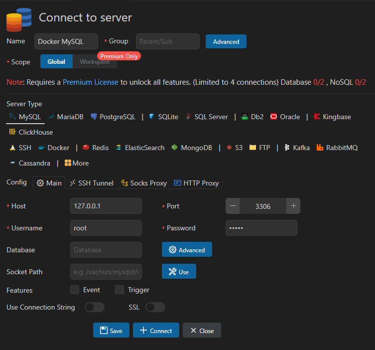
            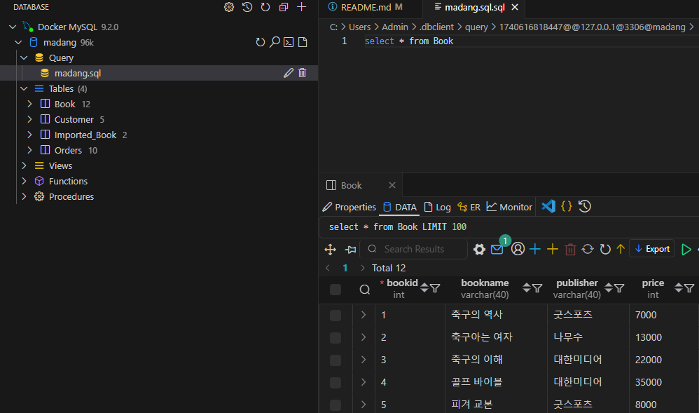
        2. Weijan Chen 개인개발자가 만든 MySQL 확장 
        3. Oracle에서 개발한 MySQL Shell for VS Code 
            - 왼쪽 툴바에 돌고래 아이콘 생성됨
            - MySQL Shell에서 위자드 Next -> 인증서 설치 -> VS Code 재시작 - > workbench 첫화면과 동일한 화면 나타남
            - new connection
             

- SQL 기초
    - 기본 데이터형
        - 데이터베이스에는 엄청 많은 데이터형이 존재(데이터 사이즈 저장용량을 절약하기 위해서)
        - 주요 데이터형
            - SmallInt(2byte) - 65535가지 수(음수포함)(-32768~32767)
            - Int(byte) -42억 정수(음수)
            - BigInt(8byte) 
            - Float(4byte) - 소수점아래 7자리까지 저장
            - Decimal(5~17byte) - Float보다 더 큰 수 저장
            - `Char(n) - n은 가변(1~255). 고정길이 문자열`
                - `주의점! 글자 입력시, Char(10)에 Hello 글자를 입력하면 'Hello     '`
            - ` Varchar(n) - n(1~65535) ,가변길이 문자열`
                - `주의점! 글자 입력시, Varchar(10)에 Hello 글자를 입력하면 'Hello'`
            - Longtext(최대4GB) - 뉴스나 영화스크립트 저장
            - LongBlob(최대4GB) - mp3, mp4음악, 영화데이터 자체 저장
            - Date(3) - 2025-02-27 까지 저장
            - DateTime(8) - 2025-02-27 10:46:34까지 저장
            - JSON(8) - json 타입

- SQL 기초>데이터 정의어 - CREATE, ALTER, DROP
    - 테이블 생성 후 확인 - DATABASE탭 -> REVERSE Engineer
    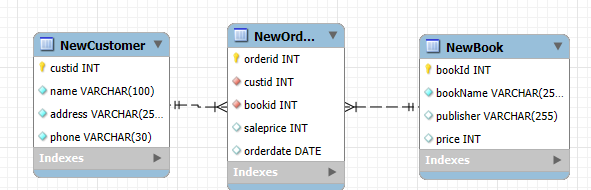

    - DROP
        - `DROP 은 매우 위험하니 사용 금지!!`
        - 외래키로 연결되어 있을 경우
            - `부모테이블 선삭제일 때,  3730:Cannot drop table reference ...`
            - `자식테이블 선삭제, 부모테이블 후삭제`
            ```sql
            DROP TABLE NewOrders;
            DROP TABLE NewBook;
            ```
    - CREATE [SQL](./day19/da01_create.sql)
        - DATABASE
        - TABLE 
            - 속성 데이터형 ,기본키 , 제약조건(NOT NULL, UNIQUE, DEFAULT, CHECK) , 외래키
            - 기본키를 정한 테이블의 경우, SELECT TABLE 했을 때 마지막행에 NULL이 뜬다. 기본키 없을 경우, 마지막행은 데이터가 들어있는 마지막행이다.
            ```sql
            -- 기본키가 1개 또는 2개이상일 경우,
            CREATE TABLE NewBook (
                bookId    INTEGER ,
                bookName  VARCHAR(255) NOT NULL,
                publisher VARCHAR(255) UNIQUE,
                price     INTEGER DEFAULT 10000 CHECK (price >=1000),
                PRIMARY KEY (bookId)
            );
            -- 기본키가 하나면 컬럼 하나에 작성 가능. 
            -- 기본키가 2개이상일 경우, 컬럼에 PRIMARY KEY를 두군데 이상 작성 불가
            CREATE TABLE NewCustomer(
            custid  INTEGER PRIMARY KEY ,
            name 	VARCHAR(100) NOT NULL,
            address VARCHAR(255) NOT NULL,
            phone   VARCHAR(30) NOT NULL
            );
            ```
            ```sql
            CREATE TABLE NewOrders(
            orderid INTEGER ,
            custid  INTEGER NOT NULL,
            bookid  INTEGER NOT NULL, 
            saleprice INTEGER, 
            orderdate DATE,
            PRIMARY KEY (orderid),
            FOREIGN KEY (custid) REFERENCES NewCustomer(custid) ON DELETE CASCADE,
            FOREIGN KEY (bookid) REFERENCES NewBook (bookId) ON DELETE CASCADE
            );
            ```
    - ALTER [SQL](./day19/da02_drop_alter.sql)
        - ADD, MODIFY, DROP
        ```sql
        ALTER TABLE NewBook ADD isbn VARCHAR(13);

        ALTER TABLE NewBook MODIFY isbn INTEGER;

        ALTER TABLE NewBook DROP COLUMN isbn;

        -- NewBook 테이블에 publisher값을 null로 가진 행이 있을 경우, 1138:invalid use of null value
        ALTER TABLE NewBook MODIFY publisher VARCHAR(255) NOT NULL;
        ```

- SQL 기초> 데이터 조작어-  삽입(INSERT) , 삭제(DELETE) , 수정(UPDATE)
    - AUTO_INCREMENT 
        - INSERT 시 코드에 기입하지 않음
        - 삭제한 번호를 재사용할 수 없다. 

    - INSERT [SQL](./day19/da02_drop_alter.sql)
        - 기본형, 생략형, `다중데이터 입력, 테이블 입력`
    ```sql
    INSERT INTO 테이블명(속성1, 속성2 ..) VALUES (값1, 값2 ...);

    -- 생략형
     INSERT INTO 테이블명 VALUES (값1, 값2 ...);

      -- 다중데이터 입력
     INSERT INTO 테이블명(속성1, 속성2 ..)
      VALUES (값1, 값2 ...),
             (값1, 값2 ...);

    -- 한 테이블에 있는 많은 데이터를 다른 테이블로 복사하는데 가장 효과적인 방법
    INSERT INTO Book(bookid, bookname, publisher, price)  
    SELECT bookid, bookname, publisher, price FROM Imported_Book;
    ```

    - UPDATE [SQL](./day19/da04_update_delete.sql)
        - 우측 톱니바퀴 아이콘 (Show Preference Dialog) - SQL Editor - 제일 아래 Safe Updates (rejects UPDATEs and DELETEs with no restrictions) 체크
            - 1175  You are using safe update mode ... : where절 없이 update 시, 모든 행이 다 적용됨을 경고       
    ```sql
    UPDATE 테이블명 SET 속성 = 값 , 속성 = 값  WHERE 조건;
    ```
    - DELETE 
        - 우측 톱니바퀴 아이콘 (Show Preference Dialog) - SQL Editor - 제일 아래 Safe Updates (rejects UPDATEs and DELETEs with no restrictions) 체크
            - 1175  You are using safe update mode ... : where절 없이 DELETE 시, 모든 행이 다 적용됨을 경고   
     ```sql
    DELETE FROM 테이블명 WHERE 조건 ;
    ```    
- SQL 고급
    - 내장함수
        - 숫자함수 
        ```sql
        SELECT ABS(-78), ABS(+78);
        SELECT ROUND(4.875);	-- 5
        SELECT ROUND(4.875,1); -- 4.9
        ```
        - 문자함수 
            - `replace(문자열, 문자, 문자)는 화면 출력용, 데이터베이스에 값을 변경하려면 UPDATE문 써야함.`
            - `char_length() 문자수 , length() 바이트수` ,  -- utf8에서 한글 한글자의 바이트 수는 3bytes , 공백 바이트 수는 1byte
            - `SUBSTR(문자열, 처음시작 인덱스, 개수)` **DB은 인덱스 1부터**
        ```sql
        -- TRIM
        SELECT CONCAT('--' ,TRIM('     HELLO     '),'--');  -- --HELLO--
        SELECT CONCAT('--' ,LTRIM('     HELLO     '),'--');  -- --HELLO     --
        SELECT CONCAT('--' ,RTRIM('     HELLO     '),'--');  -- --     HELLO--

        SELECT TRIM('=' FROM ' ===HELLO==='); -- ===HELLO
        SELECT TRIM('=' FROM '===HELLO==='); -- HELLO
        ```
        - 날짜, 시간 함수
            - SYSDATE()  -- Docker 서버시간을 따라서 그리니치천문대 시간 기준임 , 한국시간은 +9 해야함
            - ADDDATE(SYSDATE(), INTERVAL 9 HOUR) AS '한국 시간'
            - DATEDIFF(DAY1, DAY2) DAY1-DAY2가 결과로 나옴   
            - 포맷 
                - %Y(4자리 연도) %y(4자리 연도 중 마지막 2자기) %M(월이름 영어 January) %m(01~12) %b(월 약어 Jan) %d(00~31) 
                - %H(00~23시간) %h(01~12시간) %i(0~59) %s(0~59) %p(AM/PM)
                - `1000단위마다 , 넣기`
                ```sql
                 SELECT bookid, bookname, FORMAT(price, 0) AS price
                 FROM Mybook;
                ```
    - NULL 값 처리
        - '0', ''. ' '(공백) 등과 다른 특별한 값
        - IS NULL, IS NOT NULL
        - 집계함수 사용할 때 주의할점 : NULL + 숫자는 NULL이다. Null이 포함된 행은 집계에서 빠진다.(예 - count(*))
        
        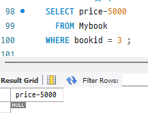
        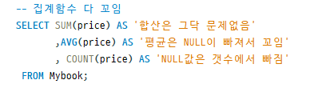

        - IFNULL(속성, 값) 속성이 널 일때, 값으로 결과반환

## 20일차 : 2월 28일
- SOL고급
    - 데이터베이스 인덱스는 1부터 시작
    - 행번호 출력 (@seq  , LIMIT, OFFSET) [SQL](./day20/da01_row_expression.sql)
    ```sql
    
    SET @seq := 0 ; -- 변수선언: SET으로 시작하고 @를 붙임. 값할당은 := 임

    SELECT (@seq := @seq +1 ) AS '행번호'
        , custid
        , name
        , phone
    FROM Customer
    WHERE @seq <2 ;
 
    SET @seq := 0 ; 
    SELECT (@seq := @seq +1 ) AS '행번호'
        , custid
        , name
        , phone
    FROM Customer
    LIMIT 2;

    -- 특정범위 추출 (인덱스 3의 다음 인덱스 행부터 2개를 추출)
    SELECT
        custid
        , name
        , phone
    FROM Customer
    LIMIT 2 OFFSET 3;   --4, 5행
    ```
- SOL고급 >서브쿼리 [SQL] (./day20/da02_query.sql)
   
    - 스칼라 부속질의 : select 부속질의 /**단일행, 단일열**
    ```sql
    SELECT o.custid
    , (SELECT name FROM Customer WHERE custid = o.custid) -- select 서브쿼리는 스칼라값. 단일행, 단일열이어야 하므로 *이 아닌 name
    , SUM(o.saleprice)
    FROM Orders o 
    GROUP BY o.custid ;
    ```
    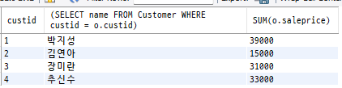 서브쿼리자체가 나오기에 별칭하면 보기 수월함

    - 중첩질의 : WHERE  부속질의 
        - 단일값, 다중행
        - 다중행일 경우,
            - IN, NOT IN 
            - `ALL(모든값과 비교하여 참, MAX), SOME(어떤 하나의 값과 비교하여 참, MIN), ANY`
            - EXISTS (상관쿼리에서 씀)

         - `서브쿼리에서 두가지 컬럼을 비교하는 법 (파이썬 튜블과 유사)`
        ```sql
        SELECT *
        FROM Orders
        WHERE (custid, orderid) IN ( SELECT custid, orderid
                                    FROM Orders
                                   WHERE custid =2
                                );
        ```
    - 인라인 뷰 : FROM 부속질의
        - 가상테이블을 만들고 이름짓고, from에 넣어줌
        ```sql
        -- 가상테이블
        SELECT custid
                , name
        FROM Customer c
        WHERE custid <=2 ;
        
        -- 가상테이블을 cs라고 이름짓고, from에 넣어줌
        SELECT cs.name, SUM(o.saleprice) AS '구매액'
        FROM ( SELECT custid
                        , name
                    FROM Customer 
                    WHERE custid <=2  ) AS cs , Orders As o
        WHERE cs.custid = o.custid
        GROUP BY  o.custid
        ;
        ```

- SQL고급> 뷰 [SQL](./day20/da03_view.sql)
    - CREATE OR REPLACE(생성, 수정) VIEW , DROP
      ```sql
        CREATE  OR REPLACE  VIEW 뷰이름
        AS SELECT문;

        --  뷰실행
        SELECT *
        FROM 뷰이름;

        DROP VIEW 뷰이름;
        ```

    - INSERT, UPDATE, DELETE도 가능하나 제약이 따름
        - 뷰의 테이블이 하나여야 함
        - 조인된 테이블로 뷰를 만들 경우, 안됨
        - 관계에서 자식테이블의 뷰는 INSERT불가


- SQL고급> 인덱스  [SQL](./day20/da04_index.sql)
    - 실행계획(QUERY 탭의 Explain Current Statement) - 인덱스나 조인 등에서 쿼리 중 어디에서 가장 처리비용이 많이 발생하는지
    
    - 클러스터 인덱스
        - 테이블당 하나
        - 테이블의 기본키에 대하여 클러스터 인덱스를 생성한다.
        - 행이 추가되거나 삭제될 때 , 클러스터 인덱스 변경에 시간이 많이 걸린다.
    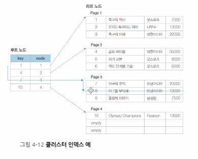

    - 보조 인덱스(Non-clustered)
        - 보조 인덱스를 검색하여 기본키 속성을 찾은 다음 클러스터 인덱스로 가서 해당 레코드를 찾는다.
    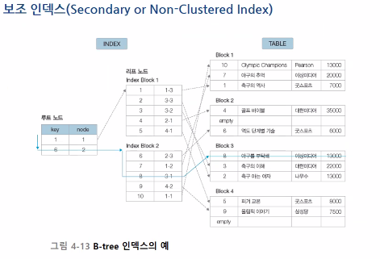
   
    ```sql
    CREATE INDEX 인덱스명 
        ON 테이블명(컬럼명 , 컬럼명);

    SHOW INDEX FROM 테이블명;

    -- 인덱스 최적화
    ANALYZE TABLE 테이블명;

    DROP INDEX 인덱스명 ON 테이블명;
    ```
    
    
    - 주의사항
        - WHERE절에 자주 사용하는 컬럼에 인덱스 생성
        - 조인문에 사용하는 컬럼(PK포함) 인덱스 생성
        - 테이블당 인덱스 개수는 5개미만 생성할 것(너무 많으면 성능저하)
        - 자주 변경되는 컬럼에는 인덱스 생성말것(성능저하)
        - NULL값이 많은 컬럼에 인덱스 생성말것(성능저하)

- 데이터베이스 프로그래밍
    - 저장프로시저
        - delimiter 때문에 한줄씩 실행하는 것이 에러날 경우, 드래그해서 번개모양 아이콘 execute하기
        - 너무 많은 쿼리로 일을 처리해야 할 때, 파이썬 등 프로그램에서 구현하면 매우 복잡함 -> 저장프로시저 하나로 프로그램 구현시 코드가 매우 짧아짐
        - 개발 솔루션화, 구조화 해서 손쉽게 DB처리를 가능하게 하기 위해서
        
        1. 삽입 [SQL](./day20/da06_procedure_insert.sql)
        ```sql
        delimiter//
        CREATE PROCEDURE 프로시저명(
            IN 변수명 변수자료형 --테이블의 자료형과 일치해야함
        )
        BEGIN
            INSERT INTO 테이블명(속성1) VALUES (변수명);
        END;
        //
        --프로시저 호출
        CALL 프로시저명 (속성값);

        -- 프로시저 삭제
        DROP PROCEDURE 프로시저명;
        ```


        2. 제어 [SQL](./day20/da07_procedure_control.sql)
        ```sql
        delimiter //
        CREATE PROCEDURE 프로시저명(
            mybookname INTEGER,
            myprice INTEGER
        )
        BEGIN
            --변수선언
            DECLARE mycount INTEGER;

            SELECT COUNT(*) INTO mycount
              FROM Book
             WHERE bookname LIKE CONCAT('%',mybookname,'%');

            IF mycount !=0 THEN
                SET SQL_SAFE_UPDATES =0;
                UPDATE Book SET price= myprice WHERE bookname LIKE CONCAT('%',mybookname,'%');
            ELSE
                INSERT INTO Book VALUES (mybookname,myprice);
            END IF;
        END;
        
        -- 실행
        CALL 프로시저명(값1, 값2);
        ```        

## 21일차 : 3월 4일
- 데이터베이스 프로그래밍
    

    - 저장프로시저
        - delimiter // 
        - 변수선언 declare
        - if 조건 then 
            set 
        else
            set
         end if;
        - CALL문으로 직접 호출함

        3. 결과를 반환 [SQL](./day21/da01_out_procedure.sql)
            - 리턴문을 쓸 수 있으면 함수, 아니면 프로시저.
            - 프로시저에서도 값을 반환하려면 OUT파라미터를 선언.
        4. 커서 사용 [SQL](./day21/da02_cursor_procedure.sql)
            ```sql
            -- 커서생성
            DECLARE 커서이름  CURSOR FOR
            
            -- 커서사용시작
            OPEN 커서이름

            -- 행데이터 가져옴
            FETCH 커서이름 INTO 변수명

            --커서종료
            CLOSE 커서이름
            ```

    - 트리거 [SQL](./day21/da03_trigger.sql)
        - BEFORE , AFTER 트리거
        - 데이버 변경문 
            - INSERT 의 경우, new.
            - UPDATE, DELETE의 경우, old.
        - DML문이 실행될 때, 자동실행됨
    ```sql
    -- root계정에서 트리거 작동에 필요한 문장
    SET GLOBAL log_bin_trust_function_creators = ON;

    delimiter //
    CREATE TRIGGER AfterInsertBook
        AFTER INSERT ON Book For EACH ROW	

    BEGIN
        DECLARE average INTEGER;
        INSERT INTO Book_log
        VALUES (new.bookid, new.bookname, new.publisher, new.price);
    END;

    INSERT INTO Book VALUES (40, '말 잘하는 사람은 말투부터 다르다.' , '지니의서재', 18000);
    ```

    - 사용자 정의 함수 [SQL](./day21/da04_function.sql)
        - return 키워드를 사용
        - SELECT 문에 포함됨
    ```sql
        DELIMITER //
    CREATE FUNCTION fnc_Interest(
        price INTEGER
    )	RETURNS INTEGER
        
    BEGIN
        DECLARE myInterest INTEGER;
        IF price >= 30000 THEN
            SET myInterest = price *0.1;
        ELSE SET myInterest =  price *0.05;
        END IF;
        RETURN myInterest;
    END;


    -- 실행
    SELECT custid, orderid, saleprice, fnc_Interest(saleprice) as '이익금'
    FROM Orders;
    ```    
    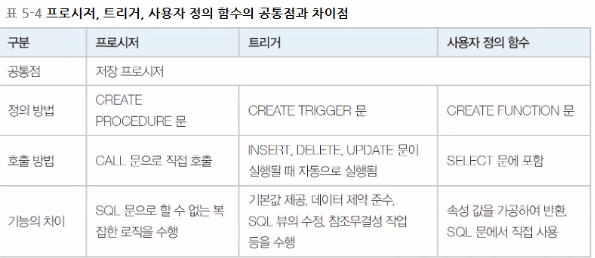
    
- 데이터베이스 연동 파이썬 프로그래밍 [NoteBook](./day21/da05_파이썬_db연동.ipynb)
- 데이터베이스 연동 웹 프로그래밍 [NoteBook](./day21/da06_flask.py)


- 데이터모델링
    - 현실세계에 데이터처리내용을 디지털환경에 일치시켜서 모델링
    - db 생명주기
        1. 요구사항 수집 및 분석
        2. 설계
        3. 구현
        4. 운영
        5. 감시 및 개선

    - 모델링 순서
        - 개념적 모델링 
            - 요구사항 제대로 반영하였는지, 업무처리 절차에는 문제가 없었는지
            - E-R 다이어그램
                - 개체
                    - 강한 개체 - 독자적으로 존재
                    - 약한 개체 - 상위 개체 타입을 가짐 
                - 속성
                    - 속성   -타원
                    - 키 속성 - 밑줄
                    - 약한 개체의 식별자 - 식별자 아래에 점선을 그음. 키를 갖지 못하고 대신 식별자를 가짐
                    - 다중값 속성 - 이중 타원  (예)취미와 같이 여러 개의 값을 갖는 속성
                    - 유도 속성 -  점선타원 (예) 나이와 같이 출생 연도로 유도가 가능한 속성
                    - 복합 속성 - 큰 타원 아래 작은 타원으로 연결함 (예) 주소 - 시, 동, 번지
                - 관계
                    - 유형
                        - 일대일
                        - 일대다
                        - 다대일
                        - 다대다
                    - ISA관계 
                    - 참여 제약 조건
                        - 전체참여 - 실선 2개, 최솟값이 1이상
                        - 부분참여 -실선 1개,최솟값이 0이상

                    - 역할
                    - 순환적 관계
            - IE 표기법
                - 관계와 관계 대응수
                    - 점선  - 비식별자, 강한개체, 부모개체의 키가 일반속성으로 포함
                    - 실선  - 식별자, 약한개체, 부모 개체의 키가 주식별자로 포함
                    - 1대다 - N쪽에 새발을 표시
                    - 선택참여 0 - 최소참여 0
                    - 필수참여 1 - 최소참여 1
                    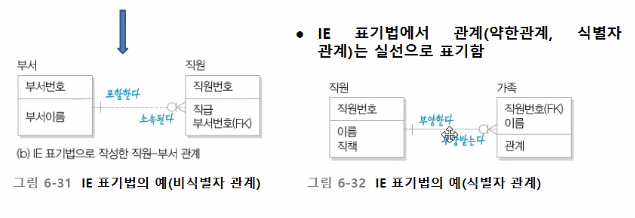
    
        - 논리적 모델링
            - ER다이어그램 체계화, 키 선정(추가),상세속성 추출, 정규화, 표준화

        - 물리적 모델링
            - 물리적 구조, 트랜잭션 검토, 저장 공간 설계측면, 응답시간 최소화

    - 모델링 실습
        - erwin [erwin](./day21/madangstore.erwin)
            - file -> new -> logical/physical  , mysql, 5.x 
            - model탭 -> model property -> notation -> ie로 바꾸기
            - erwin에서 만든 모델링을 mysql로 가져가기 : tool->forward engineer ->schema generation -> preview -> 코드 복사하여 mysql쿼리에서 실행 [sql](./day21/erwin.sql)
            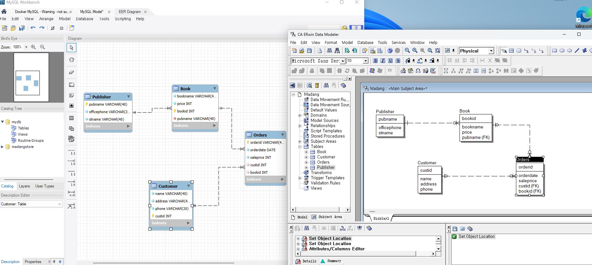
        - workbench

## 22일차 : 3월 5일
- docker에서 mysql 실행
    - 터미널에서 
        - docker update --restart=always mysql-container 자동 시작  
        - docker restart mysql-container 재시작 명령어
        
- 데이터모델링(WITH MySQL workbench의 ER다이어그램)  da01_마당대학_workbench_modelin.mwb
    - 마당대학 데이터베이스
        - 개체- 기본키, 외래키
        - 관계- N-M관계일 경우, 교차테이블 생성
        - database탭-forward engineer - next해서 생성 -> schema업데이트하여 db생성 확인
- 정규화
    - 이상현상 [SQL](./day22/da02_정규화_이상현상.sql)
        - 정규화를 제대로 못한 db면 발생 가능
        - 삭제이상 - 투플 삭제 시 같이 저장된 다른 정보까지 연쇄적으로 삭제   
        - 삽입이상 - 특정 속성에 해당하는 값이 없어 NULL값을 입력해야 하는 현상
        - 수정이상 - 튜플 수정 시 중복된 데이터의 일부만 수정되어 데이터의 불일치 문제
    - 함수종속성
        - 개념
            - 어떤 속성 A의 값을 알면 다른 속성 B의 값이 유일하게 정해지는 의존 관계
            - 속성B는 속성A에 종속한다. 
            - 속성A는 속성B를 결정한다.
            - A→B
            - A는 결정자, B는 종속속성

        - 종류
            - 완전함수종속 - 종속성에 일치하지 않은 속성들이 하나도 없는 경우
            - 이행적종속 - A→B ,B→C 일 때, A->C 

        - 함수종속성과 기본키
            - 릴레이션 R(K, A1, A2 , ...) 에서 K가 기본키면, K->R이 성립. 즉 기본키K는 릴레이션의 모든 속성에 대해 결정자임

        - 한 릴레이션의 함수 종속 X->Y 에서 가능한 X의 경우는 많다. 그러나 이러한 함수 종속성을 모두 찾을 필요는 없다.
            - 예를 들어, D->A가 성립한다면 함수 종속성 규칙에 따라 결정자 D쪽에 어떤 속성을 추가해도 함수종속성은 성립한다.   
            - 따라서 D->A가 성립하면 BD->A , CD->A는 당연히 성립한다.

       
        
    - 정규화 
        - 이상현상을 없애는 과정
        - 정규화 과정
            - 참고 사이트 : https://velog.io/@wisdom-one/%EC%A0%95%EA%B7%9C%ED%99%94Normalization
            - 제 1정규형 - 릴레이션 R의 모든 속성 값이 원자값을 가짐(한 컬럼에 여러값이 들어갈 수 없음)
            - 제 2정규형 - 제 1정규형 + 기본키가 아닌 속성이 기본키에 완전 함수 종속일 때
            - 제 3정규형 - 제 2정규형 + 기본키가 아닌 속성이 기본키에 비이행적으로 종속할 때 . 이행적 종속성이 발생하면 안 됨
            - BCNF       - 릴레이션 R에서 함수종속성 X->Y가 성립할 때 모든 결정자 X가 후보키이다.(무손실 분해)
            - 무손실 분해 
                - 무손실 분해는 두 관계를 분해했을 때, 원래의 관계를 완전히 복원할 수 있는 분해를 의미
                -  (R1 ∩ R2) → 모든 속성을 결정할 수 있어야 함. 즉, 두 관계가 공유하는 속성 R1 ∩ R2가 R1과 R2에 있는 모든 속성을 결정할 수 있어야 합니다.
            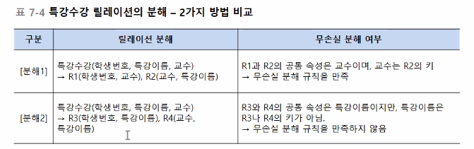
            - 제 4정규형 - 다치종속성
            - 제 5정규형 - 조인종속성

    
- 트랜젝션
    - 데이터를 다루는 논리적인 작업의 단위 
    - 특성(ACID)
        - 원자성 [SQL](./day22/da05_트랜잭션_원자성.sql)
            - ALL OR NOTHING
            - START TRANSACTION에서 COMMIT 까지는 트랜잭션이 살아있음
            - SAVEPOINT는 트랜잭션 상에서  ROLLBACK TO로 이동 가능
            - ROLLBACK 전부 취소
         ```sql
        START TRANSACTION;
        SAVEPOINT 변수;
        ROLLBACK TO 변수;       -- SAVEPOINT이후는 무효화
        COMMIT;
        ROLLBACK;       -- SAVEPOINT없을 시, 전체 과정 다 지워짐

        -- 자동커밋 해제
        SET AUTOCOMMIT = 0 ;
        ```
        - 일관성
        - 고립성
        - 지속성 
            - 정상적으로 완료되거나 부분완료된 데이터는 반드시 데이터베이스에 기록되어야 함
            - 부분완료 - 트랜잭션은 수행 완료.변경내용이 데이터베이스에 기록되었는지 확실하지 않은 상태
            - 실패 - 트랜잭션을 중간에 중단. 부분완료상태에서 변경내용을 데이터베이스에 저장하지 못한 상태
            - 완료 - DBMS가 최종적으로 변경 내용을 데이터 베이스에 기록
    - 동시성 제어 [SQL](./day22/da06_동시성제어(mysql))
        - vscode db 의 madang2테이블의 쿼리 , mysql의 madang2테이블의  쿼리를 동시에 실행할 수 없다.  =>Lock wait timeout exceeded;try restarting transaction 
        - 하나의 트랜잭션이 commit되어야 다른 트랜잭션이 실행가능하다. 

        - 락 
            - 갱신손실문제 해결위한 트랜잭션이 데이터를 읽거나 수정할 때 데이터에 표시하는 잠금장치
            - 락을 이용하여 자신이 사용할 데이터를 잠그면 다른 트랜잭션은 잠금이 풀릴 때까지 기다려야한다.
            - dead lock : 다른 트랜잭션이 commit될 때까지 무한대기

- 회복
    - 로그파일을 이용한 회복
        - REPO : 로그파일에 기록된 로그를 이용하여 트랜잭션이 수행한 결과를 다시 반영하는 연산
        - UNDO : 로그 파일에 기록된 로그를 이용하여 트랜잭션이 수행한 결과를 취소하는 연산
    - 회복을 위한 로그 기록 방법
        - 즉시갱신 : 트랜잭션은 '갱신데이터->로그','버퍼->데이터베이스' 작업이 부분 완료 전에 동시에 진행될 수 있으며, REPO, UNDO연산을 이용하여 복구
        - 지연갱신 : 트랜잭션은 '갱신데이터->로그'가 끝난 후 부분완료를 하고 '버퍼->데이터베이스'작업은 부분 완료 후에 진행함.REPO 연산을 이용하여 복구

    - 체크포인트 
        - 데이터베이스와 트랜잭션 로그파일을 동기화한 후, 동기화한 시점을 로그 파일에 기록해 둠

## 23일차 : 3월 6일
- 인덱스 실습 [SQL](./day23/da01_index.sql)
    - 500만건 조회시 price로 검색
        - 인덱스 없으면 0.67초 소요
        - 인덱스 걸면 0.06초 소요

- 데이터 베이스 관리와 보안
    - 데이터베이스 관리 업무
        - 서비스관리
        - 점검 및 모니터링
        - 장애 대처
        - 백업과 복원
        - 사용자 관리 및 권한 관리
        - 시스템 데이터베이스 관리
        - 사용자 데이터베이스 관리
        - 데이터베이스 저장 공간 관리
        - 인덱스 관리
    - 데이터베이스 관리 기본 명령
    ```sql
    -- db 리스트
    SHOW DATABASES;
    
    -- db 1개 선택
    use db명;

    -- 한 db의 테이블 리스트
    SHOW TABLES;

    -- 테이블 구조
    DESC 테이블명;

    SELECT * FROM 테이블명;
    ```
    - 로그인 사용자 관리
        - 사용자 계정 생성
        ```sql
        -- 내부접속 @localhost
        CREATE USER [사용자이름] IDENTIFIED BY '[비밀번호]';

         -- 외부접속 @'%'
        ```
        - 권한
        ```sql
        GRANT 권한 (테이블의 컬럼) ON 테이블 TO 사용자 WITH GRANT OPRION;
        FLUSH PRIVILEGES;  -- 데이터베이스에서 권한 변경 사항을 즉시 반영하도록 서버에 알리는 역할
        
        GRANT ALL PRIVILEGES (테이블의 컬럼) ON 테이블 TO 사용자 WITH GRANT OPRION;
        FLUSH PRIVILEGES;  --

        REVOKE 권한 (테이블의 컬럼) ON 테이블 FROM 사용자;
        FLUSH PRIVILEGES;
        ```
    - 백업과 복원
        - 백업
            - 전체 백업 - 백업 수행할 때마다 수행 시점의 모든 데이터를 백업 , 데이터 중복 저장, 많은 시간 소요
            - 차등 백업 - 전체 백업을 수행한 이후 변경된 데이터만 저장
            - 증분 백업 - 데이터베이스에서 수행한 작업을 기록하고 있는 트랜잭션 로그 파일을 저장, 최초에 전체 백업을 수행한 후 로그 백업 수행
        - MySQL 백업
            - 물리적 백업
                - 콜드 백업 - 셧다운 한 후에 백업 진행
                - 핫 백업   - 운영 중인 데이터베이스 파일 복사
            - 논리적 백업 - 데이터베이스에 있는 내용을 별도의 파일로 옮겨 백업하는 방법
                - `server탭 - data export /import`
        - 복원 - 장애가 발생하여 운영 중인 데이터에 손상이 발생했을 때, 이전에 복사해 둔 백업 파일을 사용하여 데이터를 원래대로 되돌려 놓는 작업


- 실무 실습
    - A.SQL Practice [SQL](./day23/da05_sql_practice.sql) 
        ```sql
        where 필드명 not between A and B

        --첫글자는 대문자, 나머지는 소문자
        concat(Upper(substring(first_name,1,1)) , lower(substring(first_name,2,char_length(first_name))))
        
        -- 요일(%W) , 요일정렬(%w)
        SELECT CONCAT(first_name, ' ', last_name) as Name , hire_date, date_format(hire_date, '%W') AS 'Day of the week'
        FROM employees
        ORDER BY date_format(hire_date, '%w') ; 

        /*
        %w의 의미:
        **%w**는 0부터 6까지의 숫자를 반환하며, 숫자는 **일요일(0)**부터 **토요일(6)**까지의 요일을 나타냅니다.
        0: 일요일
        1: 월요일
        2: 화요일
        3: 수요일
        4: 목요일
        5: 금요일
        6: 토요일
        */

        -- 세자리 구분 기호
        concat('$',format(round(sum(salary),0) , 0) )as salary ,   -- 1,000
        concat('$',format( round(avg(salary),1) , 1) ) as average,  -- 1,000.0

        -- 서브쿼리
        select grade_level from job_grades
        where e.salary between lowest_sal and highest_sal 
        ```
    - 단일 행 함수의 종류
        - 문자조작 - UPPER(), LOWER(), REPLACE(), SUBSTRING(), LTRIM(), CONCAT()
        - 숫자관련 - ROUND(), TRUNCATE(), MOD(), POWER()
            - TRUNCATE()는 MySQL에서 테이블의 모든 데이터를 삭제하는 명령입니다. TRUNCATE는 DELETE와 비슷하게 작동하지만 몇 가지 중요한 차이점이 있습니다.
        - 날짜관련 - SYSDATE(), DATE_ADD(, inteval 9 HOUR), DATE_SUB(), FROM_DAYS()
            - FROM_DAYS(738919) : MySQL의 기준 날짜(0000-01-01)로부터 738919일이 지난 날짜를 계산해 반환합니다.
        - 변환함수 - CONVERT(), CAST()    
            - CONVERT(expression, type) -expression은 변환할 값입니다.type은 변환하려는 데이터 타입입니다.      예를 들어, CHAR, DATE, DATETIME 등이 될 수 있습니다. 
            - CAST(expression AS type)- expression은 변환할 값입니다. type은 변환하려는 데이터 타입입니다. 예를 들어, CHAR, DATE, DATETIME, SIGNED 등이 될 수 있습니다.
            -  unsigned (양수만)  , signed (음수포함)
 ## 24일차 : 3월 7일
- Workbench Tip
    - SQL툴 공통으로 SELECT 실행시 모든 행을 다 표시하지 않음.(성능저하 대비)
    - workbench는 1000개로 제한
    - 성능테스트 시 1000개 제한을 풀어줘야 함
    - `메뉴 Edit-Preferences >SQL Editor > SQL Execution에서 Limit Rows Count 조절 및 limit Rows 체크`
    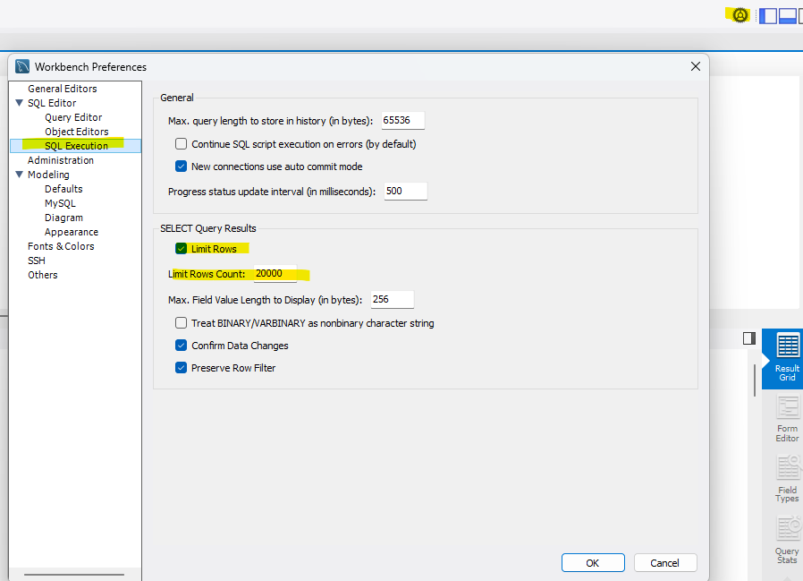

- 실무연습
    - A. SQL Practice
        - `서브쿼리 (튜플형태)`
        ```sql
        SELECT *
        FROM employees
        WHERE (job_id, salary ) IN (
                                        SELECT job_id, MIN(salary)
                                        FROM employees
                                        GROUP BY job_id );
        ```
        - 집합 UNION, UNION ALL [SQL](./day24/da01_union.sql)
            - mysql에서는 intersect, minus 지원하지 않기에 join으로 연결해서 풀어야 함
            - 집합 구현시 양쪽 테이블의 컬럼수 및 데이터 타입은 반드시 같아야 한다.
            - 만일 공통된 컬럼이 없을 경우, NULL 처리를 하고, 필요에 따라 데이터 타입을 변환하여 일치시킨다.

        - 조건문 case 
            - 월별조회  [SQL](./day24/da02_case.sql)
            ```sql

            SELECT @@sql_mode;
            -- GROUP BY 때 SELECT * 하면 경고창 뜨기 위한 코드
            SET SESSION sql_mode = 'ONLY_FULL_GROUP_BY';   

            -- Error Code: 1055. Expression #2 of SELECT list is not in GROUP BY  에러 해결코드
            SET SESSION sql_mode = 'STRICT_TRANS_TABLES, NO_ZERO_IN_DATE, NO_ZERO_DATE, ERROR_FOR_DIVISION_BY_ZERO, NO_ENGINE_SUBSTITUTION';
          
            /*
            이 SQL 모드 설정을 통해 MySQL 세션에서 쿼리 실행, 데이터 유효성 검사, 에러 처리 방식을 엄격하게 설정하게 됩니다. 이를 통해 다음과 같은 효과를 얻을 수 있습니다:

            ONLY_FULL_GROUP_BY: GROUP BY 절에 대한 규칙을 엄격하게 적용하여 예기치 않은 결과를 방지합니다.
            STRICT_TRANS_TABLES: 데이터의 무결성을 보장하기 위해 잘못된 값을 삽입할 때 오류를 발생시킵니다.
            NO_ZERO_IN_DATE, NO_ZERO_DATE: 잘못된 날짜 값(예: '0000-00-00' 또는 '2025-00-01')을 방지합니다.
            ERROR_FOR_DIVISION_BY_ZERO: 0으로 나누는 연산에서 오류를 발생시켜 부정확한 결과를 방지합니다.
            NO_ENGINE_SUBSTITUTION: 사용 불가능한 저장 엔진을 대체하지 않도록 설정합니다.
            이 설정은 일반적으로 프로덕션 환경에서 데이터의 일관성과 정확성을 보장하기 위해 사용됩니다.
            */
            ```
        - 그룹화 ROLLUP, grouping [SQL](./day24/da03_rollup_grouping.sql)
            ```sql
             -- 전체를 그룹화한 수행 결과 1/ 부서에 대해서만 그룹화 수행결과 12 /부서와 업무별 그룹화 수행결과 20 =>총 33행
             group by department_id, job_id WITH ROLLUP;

            -- grouping() 함수를 사용하여 그룹화된 컬럼의 수준을 확인합니다.
            -- 전체를 그룹화한 수행 결과 1 all-depths  all-jobs
            -- 부서에 대해서만 그룹화 수행결과 12  all-jobs
            -- 부서와 업무별 그룹화 수행결과 20 =>총 33행
            SELECT  department_id, job_id, 
                    CONCAT('$' , SUM(salary)) as 'Salary Sum' ,
                    count(employee_id) as 'count emps',
                    grouping(department_id),
                    grouping(job_id)
            FROM employees
            group by department_id, job_id WITH ROLLUP;
            ```
    - B. 데이터 모델링
    - C. 데이터베이스 프로젝트

- Python GUI로 DB연동 앱 개발

## 25일차 : 3월 10일
- 코딩테스트